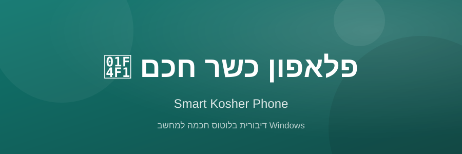

# פלאפון כשר חכם — Smart Kosher Phone



**גרסה 1.0** | Windows 10/11 | Python 3.10+ | PyQt6/PySide6

דיבורית בלוטוס חכמה למחשב Windows — מחברת את הפלאפון הכשר למחשב כדיבורית HFP ומנהלת את כל הצד הקולי: שיחות, תא קולי, הודעות, בייביסיטר, בית חכם ועוד — בממשק עברי מלא (גם אנגלית, עם מעבר RTL/LTR מיידי).

---

## 📥 הורדה והתקנה

### קובץ EXE מוכן (מומלץ — בלי Python)

| קובץ | גודל | קישור |
|---|---|---|
| `SmartKosherPhone.exe` | ~356 MB | [הורדה ישירה](https://github.com/chezy734-ship-it/smart-kosher-phone/raw/main/dist/SmartKosherPhone.exe) |

> ⚠️ הקובץ גדול ומועלה דרך **Git LFS** — ההורדה מתבצעת אוטומטית בלחיצה על הקישור (או דרך כפתור ה-Download בעמוד הקובץ ב-GitHub). חלצו והריצו — אין צורך בהתקנת Python.

### מהקוד (למפתחים)

```bash
pip install nuitka zstandard ordered-set pyinstaller
pip install PySide6 bleak sounddevice vosk
python main.py
```

---

## 🚀 הפעלה ראשונה

1. הריצו את `SmartKosherPhone.exe` (או `run.bat`).
2. בלשונית **מכשירים** — סרקו וצרפו את הפלאפון הכשר (חיבור בלוטוס RFCOMM אמיתי).
3. בלשונית **ממשק שיחה** — חיוג, מענה, יומן שיחות, הקלטות.
4. בלי פלאפון מחובר? תופיע תצוגת **מצב הדגמה** ברורה לניסיון התוכנה.

---

## ✨ תכונות עיקריות

| לשונית | מה היא עושה |
|---|---|
| **ממשק שיחה** | חיוג / שיחה פעילה / אנשי קשר / יומן / הקלטות / הגדרות |
| **מכשירים** | מספר מכשירי בלוטוס מוכרים, סריקה, זיהוי מספר אוטומטי (AT+CNUM), חיבור-מחדש אוטומטי |
| **תא קולי** | הודעות, כללי מענה, הודעות פתיח |
| **בייביסיטר** | ניטור קולי עם AI לזיהוי בכי/קול, שלוחות, התראות, מענה אוטומטי |
| **הודעות** | שליחת הודעות DTMF (TextModem) |
| **בית חכם** | שליטה ברכיבי בית חכם דרך קו טלפוני: הקצאת מקש, מצבים מותאמים, הכרזה קולית מוקלטת, הפעלה/כיבוי לזמן קצוב |
| **הגדרות** | ססמה, שפה מיידית, ערכת נושא בהיר/כהה |

### נקודות חוזק

- **עיצוב חדש** — פינות מעוגלות, ערכות נושא בהיר/כהה, מצבי hover/pressed/disabled
- **תרגום מלא לאנגלית** — יישור LTR מלא; סרגל הניווט עובר צד בלחיצה
- **מתג הפעלה/כיבוי** לכל לשונית (מבלי לאבד הגדרות)
- **אימות אמיתי** — כל פקודת AT נבדקת שנשלחה בהצלחה לפני עדכון המצב
- **תאריך עברי** מובנה בממשק

---

## 🔨 בניית EXE מקוד המקור

### אפשרות א' — קובץ EXE בודד (הכל כלול)

```bash
python -m nuitka \
  --standalone --onefile --windows-console-mode=disable \
  --windows-icon-from-ico=app\resources\icon.ico \
  --output-filename=SmartKosherPhone.exe --output-dir=dist \
  --include-package=app --include-package=bleak --include-package=vosk \
  --include-data-dir=app\resources=app\resources \
  --include-data-files=app\style_light.qss=app\style_light.qss \
  --include-data-files=app\style_dark.qss=app\style_dark.qss \
  --plugin-enable=pyside6 \
  --windows-product-name="Smart Kosher Phone" --windows-product-version=1.0.0.0 \
  main.py
```

**תוצאה:** `dist\SmartKosherPhone.exe` — רץ בלי התקנת כלום.

### אפשרות ב' — PyInstaller (חלופה)

```bash
pyinstaller --onefile --windowed --name SmartKosherPhone \
  --add-data "app\style_light.qss;app" \
  --add-data "app\style_dark.qss;app" \
  --add-data "app\resources;app\resources" \
  --hidden-import bleak --hidden-import bleak.backends.winrt \
  --hidden-import vosk --hidden-import sounddevice \
  --hidden-import PySide6.QtMultimedia \
  main.py
```

---

## 🗂️ מבנה הפרויקט

```
SmartKosherPhone/
├── main.py                 ← נקודת הכניסה
├── app/                    ← חבילת האפליקציה (מסכים, עיצוב, משאבים)
│   ├── resources/          ← אייקונים (icon.ico, icon_256.png)
│   ├── style_light.qss     ← ערכת נושא בהירה
│   └── style_dark.qss      ← ערכת נושא כהה
├── docs/banner.svg         ← באנר (קובץ זה)
└── run.bat                 ← הפעלה מהירה
```

---

## ❓ פתרון בעיות

| בעיה | פתרון |
|---|---|
| הפלאפון לא מתחבר | ודאו שהדיבורית במצב זוגות; בדקו בלשונית מכשירים שהמכשיר נראה בסריקה |
| ללא קול | ודאו שהפלאפון מוגדר כדיבורית HFP (לא A2DP בלבד) |
| הקובץ גדול מדי להורדה | זה תקין — הקובץ מכיל את כל ה-Python וספריות הקול; ניתן להריץ מהקוד עם `pip install` |
| אנטי-וירוס חוסם את ה-EXE | תופעה נפוצה עם Nuitka/PyInstaller — הוסיפו חריג (False Positive) |
